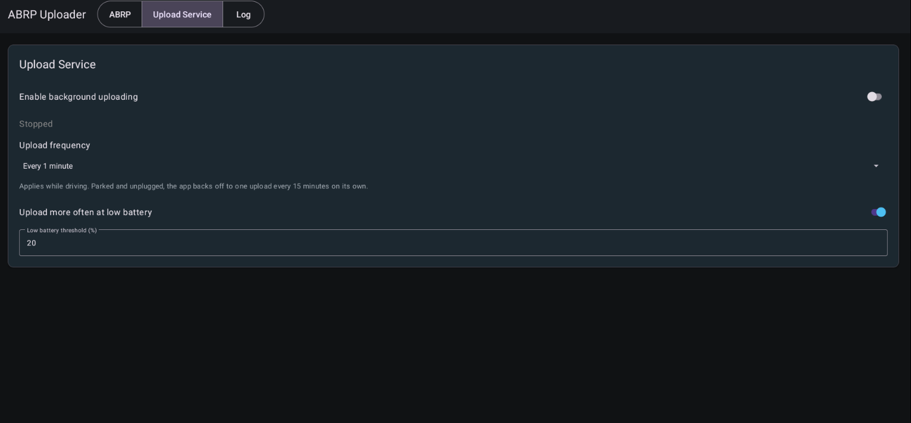
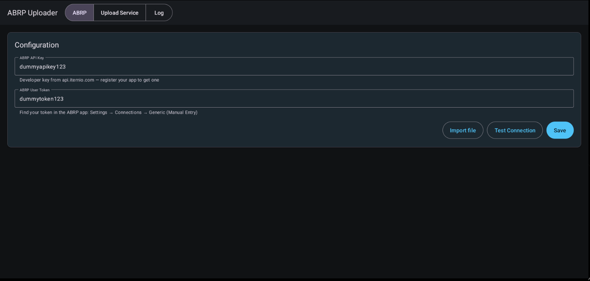

# EVABRPUploader

<p align="center"></p>

[](https://github.com/malys/EVABRPUploader/actions/workflows/tests.yml)
[](https://github.com/malys/EVABRPUploader/actions/workflows/security.yml)
[](https://github.com/malys/EVABRPUploader/actions/workflows/unstable.yml)
[](https://github.com/malys/EVABRPUploader/releases)
[](LICENSE)

Sends live telemetry from an **MG4 (SAIC eh32)** to
[A Better Route Planner](https://abetterrouteplanner.com) — battery level, speed, range,
temperature, charging state and position — straight from the car's own APIs.

No OBD dongle. No Home Assistant. No phone in the loop. The app runs on the car's head
unit and talks to ABRP directly.

> ⚠️ **No warranty, no liability.** This software is provided "as is" and runs on a
> **vehicle**. Installing it is your decision and your risk — see
> [`DISCLAIMER.md`](DISCLAIMER.md). Not affiliated with SAIC, MG Motor or Iternio.
> MG and MG4 are third-party marks used only to identify compatibility; no official origin
> or approval is claimed.

> **Fork notice.** This is a fork of Leon Kernan's `ABRP_Uploader`, substantially
> reworked. **Read [`LICENSE.md`](LICENSE.md) before redistributing anything** — the
> upstream project carries no licence, which limits what may legally be published.

---

## Contents

- [Screenshots](#screenshots)
- [Overview](#overview)
- [Install](#install)
- [Configuration](#configuration)
- [Building](#building)
- [Project layout](#project-layout)
- [Project documents](#project-documents)
- [Security](#security)
- [Contributing](#contributing)
- [Legal](#legal)
- [Credits](#credits)

## Screenshots
<p align="center">
  
  
</p>

---

## Overview
| Signal | Source | Firmwares |
|---|---|---|
| State of charge | SWI68 vendor EV property (`CarPropertyAdapter`) | SWI68 only |
| Range | SWI68 vendor EV property, falling back to standard AAOS `RANGE_REMAINING` | all supported (vendor first) |
| Speed, parked state | `EVHardware` (per-generation) | all supported |
| Outside temperature | `EVHardware` (standard AAOS) | all supported |
| Charging, DC fast charging | Charge port state + charge rate heuristic | where the VHAL implements them |
| Charged energy this session | Charge rate integrated over the session | where the charge rate is readable |
| State of energy, pack capacity, pack temperature | Standard AAOS EV properties | where the VHAL implements them |
| Odometer, tyre pressures | Standard AAOS properties (privileged) | platform-signed installs only |
| Cabin temperature | HVAC property | where the VHAL implements it |
| Climate setpoint | `EVHardware` (per-generation HVAC) | all supported |
| Position, elevation, heading | GPS | — |

Firmware-agnostic signals go through **EVHardware**, which detects the generation
(SWI68/69/131/132/133/165) and picks the right underlying API. SOC is the exception:
EVHardware exposes no EV-battery abstraction, so it still uses a vendor ID confirmed on
SWI68 and is read-supported on that generation only — see [`FIRMWARE.md`](FIRMWARE.md).

Odometer and tyre pressures sit behind privileged AAOS permissions: a platform-signed
install sends them, any other install simply omits them.

A property the car will not give up is **omitted** from the payload, never sent as zero —
so ABRP is never told the battery is empty because a read failed.

**The app never writes to the car.** It only reads. Any write path would be a bug; see
[`SECURITY.md`](SECURITY.md).

## Install
The MG4 head unit hides Settings and APK install. The known route in:
The MG4 head unit has no visible way to open Settings or install an APK. The known route
in (via the on-screen keyboard) is:

1. Open any app with a text field and tap it to raise the on-screen keyboard — e.g. the
   Amazon Music app's email/login field.
2. **Long-press** the comma `,` (or the `@`) key on the keyboard.
3. Tap **"Language settings"**.
4. Tap the **search** icon in the top bar and type **`backup`**. It opens an empty page —
   now press the **back** arrow, and you land in Android's Settings panel.
5. Enable **Developer options**, and turn on **"Install unknown apps"** (unknown sources).
6. In Settings, search **`storage`** — you now have access to internal storage and the USB
   key. Navigate to the APK and tap it to install.

> ⚠️ You are enabling developer options and sideloading on a car. Do this **parked**, and
> only with an APK you trust. See [DISCLAIMER.md](DISCLAIMER.md).

Two channels. Pick one — they install side by side.

| Channel | Auto-update | Use it if |
|---|---|---|
| **Stable** | No. Contains no updater at all. | You want the car to run what you put on it |
| **Unstable** | Yes, from GitHub pre-releases | You are testing and want fixes as they land |

Grab the APK from [Releases](https://github.com/malys/EVABRPUploader/releases). Stable builds are the tagged ones; unstable builds
are marked pre-release.

### Getting the APK onto the car

The MG4 has no visible file manager. To reach it:

1. Open **Bluetooth Settings** and select the car name.
2. Long-press the **comma** key until the keyboard settings appear.
3. **Android Keyboard Settings → Languages**.
4. Search for `file` in the search box at the top.
5. That gives you the Files app.

From there, open your USB stick and tap the APK.

### First run

1. Open the app.
2. By default, the app prefills the open-source telemetry API key published by the
   [SAIC Python MQTT Gateway](https://github.com/SAIC-iSmart-API/saic-python-mqtt-gateway#abrp-api-integration).
   You can replace it with your own key. Get a token from your ABRP account.
3. Paste the token, press **Test** (read-only — it does not send telemetry), then **Save**.
4. Turn the switch on. The service restarts with the car from then on.

Typing a long API key and token on the car's on-screen keyboard is painful. Instead you can
put them in a text file and tap **Import file** — see [Config file](#config-file) below.

## Configuration
| Setting | Default | Notes |
|---|---|---|
| Upload frequency | 60 s | 15 / 30 / 60 / 120 / 300 s. Applies while driving |
| More often at low battery | On | Tightens to 15 s below the threshold |
| Low battery threshold | 20 % | Editable, 1–99 |
| Service on/off | Off | Also the "stop uploading" control |

Parked and unplugged, the app drops to **one upload every 15 minutes** on its own,
whatever the setting. A state change — parked, plugged in, unplugged — always uploads
immediately.

### Config file

To avoid typing on the head unit, put your settings in a plain text file and tap **Import file**
on the **ABRP** tab. The app fills in whatever the file contains. Nothing is sent — press
**Test**, then **Save** as usual.

The head unit has no file picker, so the file is not chosen by hand: copy it from a PC into

```
Android/data/com.evsuite.abrp/files/
```

on the USB stick (or on the head unit's internal storage), then tap **Import file**. The app
scans that folder on every mounted volume and takes the first file that parses — the name does
not matter. If nothing is found it shows the exact path to copy to. On a phone or tablet, where
a document picker exists, the button falls back to letting you pick any file.

The file is a `key = value` list, one per line. Blank lines and lines starting with `#` are
ignored, keys are case-insensitive, and any key you leave out keeps its current value:

```
# ABRP Uploader config
api_key = your-abrp-api-key
token   = your-abrp-user-token

# optional — the cadence controls, same values as the UI
interval_sec    = 60      # snapped to 15 / 30 / 60 / 120 / 300
boost_low_soc   = true
low_soc_percent = 20      # clamped to 1–99
```

Only `api_key` and `token` are usually needed. The file is read once on import and not kept —
your credentials live only in the app's encrypted store afterwards.

### Power

The app holds **no wake lock** and schedules **no alarms**, so it cannot wake a sleeping
head unit; it costs nothing while the car is off. While the car is on, both the upload tick
and the GPS subscription cost power, and the GPS interval follows your configured
frequency.

At defaults that is roughly **59 uploads/hour driving** and **3/hour parked**.

## Building
Requires JDK 17 and the Android SDK. With [mise](https://mise.jdev):

```bash
mise install          # JDK
mise run bootstrap    # Android SDK + local.properties
mise run check        # permission gate + lint + tests
mise run build        # debug APK
```

Without mise: set `JAVA_HOME` to a JDK 17, write `sdk.dir` into `local.properties`, then
`./gradlew assembleStableDebug`.

Release builds are signed from environment variables. These sign the **APK** and have
nothing to do with your ABRP API key, which you type into the app itself:

| Variable | What it is |
|---|---|
| `SIGNING_KEYSTORE` | Path to the keystore file (CI decodes `SIGNING_KEYSTORE_BASE64` into one) |
| `SIGNING_STORE_PASSWORD` | Opens the keystore container |
| `SIGNING_KEY_ALIAS` | Which key inside it to sign with (default `platform`) |
| `SIGNING_KEY_PASSWORD` | Opens that particular key — a keystore protects each key separately |

**Never commit a keystore or a password.** Put them in `mise.local.toml`, which is
gitignored, or in GitHub Actions secrets.

## Project layout
```
app/src/main      shared code: service, car adapter, telemetry, UI
app/src/stable    no-op update hook — the stable channel cannot self-update
app/src/unstable  audited updater policy; runtime trigger currently suspended
app/src/debug     VHAL probe tools, absent from every release build
app/src/test      JVM unit tests
```

## Project documents
| Document | What it covers |
|---|---|
| [DESIGN.md](DESIGN.md) | The EVSuite design system — colour, type, touch targets, icons |
| [AGENTS.md](AGENTS.md) | Context for AI agents working in this repository |
| [CONTRIBUTING.md](CONTRIBUTING.md) | How to build, test and submit a change |
| [SECURITY.md](SECURITY.md) | Threat model and vulnerability disclosure |
| [DISCLAIMER.md](DISCLAIMER.md) | Vehicle-safety disclaimer — read before installing |
| [CHANGELOG.md](CHANGELOG.md) | Release history |
| [LICENSE.md](LICENSE.md) | Licence text |

## Security
See [SECURITY.md](SECURITY.md) for the threat model and how to report a vulnerability
privately.

## Contributing
See [`CONTRIBUTING.md`](CONTRIBUTING.md). Short version: this code runs on a moving
vehicle, so changes need tests and a clear account of what you verified on a car and what
you did not.

## Legal
- [`DISCLAIMER.md`](DISCLAIMER.md) — no warranty, no liability, not affiliated with the
  carmaker or with ABRP.
- [`LICENSE.md`](LICENSE.md) — unresolved licence status inherited from the fork source.
  Read it before redistributing.
- [`SECURITY.md`](SECURITY.md) — how to report a vulnerability privately.

## Credits
- Original app: **Leon Kernan** — the car-API approach and the first working uploader.
- ABRP telemetry API: [Iternio](https://documenter.getpostman.com/view/7396339/SWTK5a8w).
- Sibling project: **EVProfile**, whose security and CI patterns this repo reuses.
